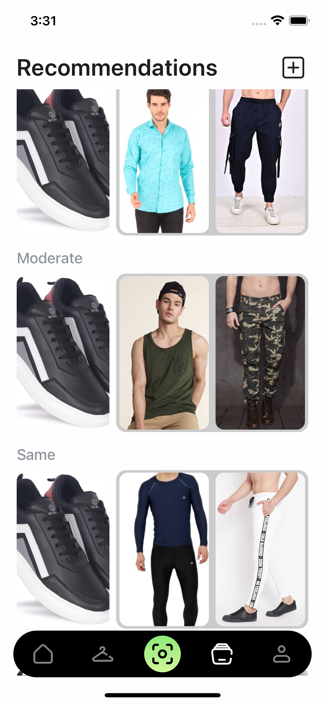

<p align="center">
  <h1 align="center">OutfitCraft</h1>  
</p>

## Introduction

The primary objective of this project is to create a tailored product recommendation system. Our aim is to design an algorithm capable of accurately and meaningfully suggesting products that align with the user's preferences, ultimately reducing the likelihood of product returns.

---

<br>
<br>

<br>
<br>

## :camera_flash: Screenshots

<div align="center" style="margin:auto;width:100%;display:flex;justify-content:center;align-items:center;flex-wrap:wrap;">





</div>

<br>
<br>

## Development

Make Sure you have [React Native development environment setup](https://reactnative.dev/docs/environment-setup)

```bash
# Install dependencies
yarn install
or
npm install
```

```bash
# Run android
npm run android
or
yarn android
```

```bash
# Run ios
npm run ios
or
yarn ios
```
